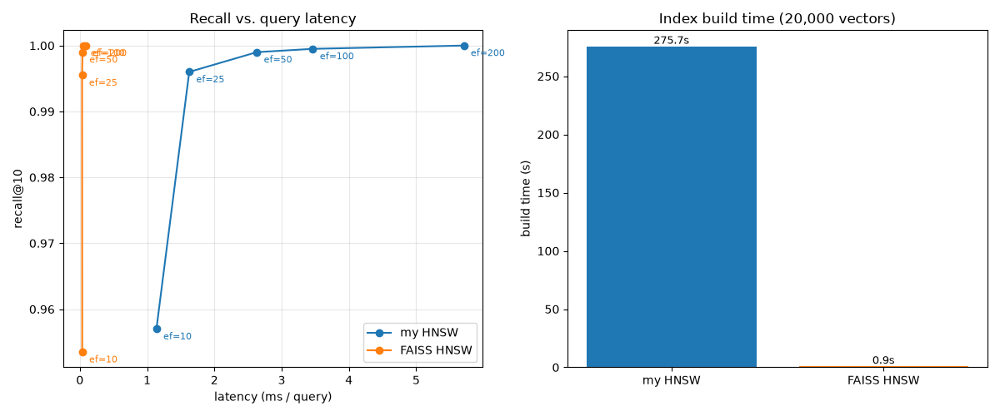

# vdb

A vector database built from scratch in Python to understand how similarity search actually works under the hood. Three retrieval strategies (brute-force, IVF, HNSW) are implemented over a shared vector store, and the HNSW implementation is benchmarked against FAISS on a real embedding dataset.

## What's in here

- **`VectorStore`** — the storage layer every index sits on: a contiguous `float32` array plus id↔row bookkeeping, `O(1)` swap-with-last delete, per-vector metadata, and vectorized brute-force (flat) search across L2, cosine, and dot-product.
- **`IVF`** (inverted file index) — partitions the vector space with a from-scratch k-means, then searches only the `nprobe` nearest clusters instead of the whole dataset. Supports incremental `add`/`delete` without a full rebuild.
- **`HNSW`** (hierarchical navigable small world) — a multi-layer proximity graph built by the Malkov & Yashunin algorithm: randomized layer assignment, greedy descent through sparse upper layers, best-first search with a diversity-aware neighbor-selection heuristic, and degree-capped pruning on insert.
- **`k_means`** and **`Metrics`** (L2 / cosine / dot) — the primitives the indexes are built on, also implemented from scratch.

## Benchmark: this HNSW vs. FAISS

Built and queried on [`fashion-mnist-784-euclidean`](http://ann-benchmarks.com) (20,000 vectors, 784 dimensions, L2), with `M=16`, `ef_construction=100` for both indexes:



| | Recall@10 | Query latency | Build time (20k vectors) |
|---|---|---|---|
| **This HNSW** | 0.957 → 1.000 (`ef_search` 10 → 200) | 1.1ms → 5.7ms | 275.7s |
| **FAISS `IndexHNSWFlat`** | 0.943 → 1.000 | ~0.05ms → 0.1ms | 0.9s |

**Recall tracks FAISS closely across the whole `ef_search` sweep** — both curves climb to ~1.0 recall@10, which is the point: it confirms the graph is built and searched correctly, not just that it runs. The gap is entirely in speed — roughly 30–50x higher query latency and ~300x longer build time, both fully explained by pure Python (dict-of-lists adjacency, per-call heap allocation, one distance computation at a time) versus FAISS's compiled, batched C++. Closing that gap wasn't the goal here; showing the algorithm is *correct* was.

Reproduce it: `src/benchmark.ipynb`.

## Usage

```python
import numpy as np
from vdb import VectorStore, IVF, HNSW, MetricType

vectors = np.random.randn(1000, 128).astype(np.float32)

# Brute-force — exact, simplest, fine for small collections
store = VectorStore(dim=128, db=vectors)
results = store.flat_search(query=vectors[0], k=5, metric=MetricType.COSINE)

# IVF — clusters the space, searches only the nprobe nearest clusters
ivf = IVF(dim=128, k=20, nprobe=5, db=vectors)
ivf.add(np.random.randn(128).astype(np.float32))
results = ivf.search(query=vectors[0], k=5, metric=MetricType.L2)

# HNSW — graph-based approximate search
hnsw = HNSW(dim=128, M=16, ef_construction=100, metric=MetricType.L2)
hnsw.build(vectors)  # inserts in shuffled order internally
results = hnsw.search(query=vectors[0], ef_search=50, k=5)
```

## Project structure

```
src/vdb/
  store/
    store.py    # VectorStore: storage, metadata, flat search
    ivf.py      # IVF index
    hnsw.py     # HNSW index + Node
  utils/
    metrics.py  # MetricType, Metrics (L2 / cosine / dot)
    k_means.py  # k-means clustering
  benchmark.py  # dataset loading, ground truth, build/sweep harness (HNSW + FAISS)
src/benchmark.ipynb   # runs the harness against a real dataset, produces benchmark.png
tests/                # pytest suite for VectorStore, IVF, HNSW, and the benchmark harness
```

## Running tests

```bash
uv sync
uv run pytest
```

19 tests covering `VectorStore` (add/delete/metadata/search across all three metrics), `IVF` (construction invariants, search-matches-brute-force, add, delete), and `HNSW` (the greedy-walk and beam-search behavior of `search_layer` in isolation, structural invariants after a full build, and recall vs. brute force).

## Design notes

- **Delete is `O(1)`, not tombstone-based.** `VectorStore.delete` swaps the removed vector with the last row and truncates, keeping the backing array dense — no periodic compaction, no fragmentation. IVF's bucket delete follows the same principle (bucket membership stores `vid`s, not row indices, so a `VectorStore` swap underneath doesn't corrupt cluster membership).
- **HNSW's neighbor selection is diversity-aware, not nearest-first.** Picking the literal `M` nearest neighbors at insert time clusters links in one direction and breaks navigability; the heuristic here only keeps a candidate if it's closer to the node being linked than to any neighbor already selected, which is what gives the graph its long-range bridging edges.

## What I'd do next

- Vectorize `HNSW`'s distance calls (currently one `_dist` call per comparison) — the biggest lever on the latency/build-time gap above.
- Persist an index to disk instead of rebuilding it every process.
- Modify `VectorStore` to be more memory efficient by allocating more space than needed initially, reducing the number of `np.array` creations needed.